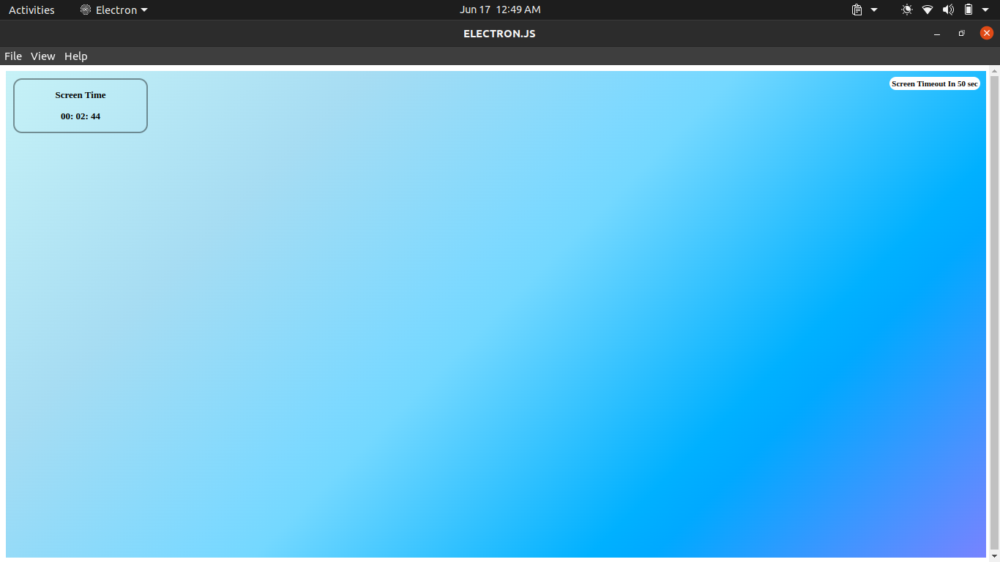
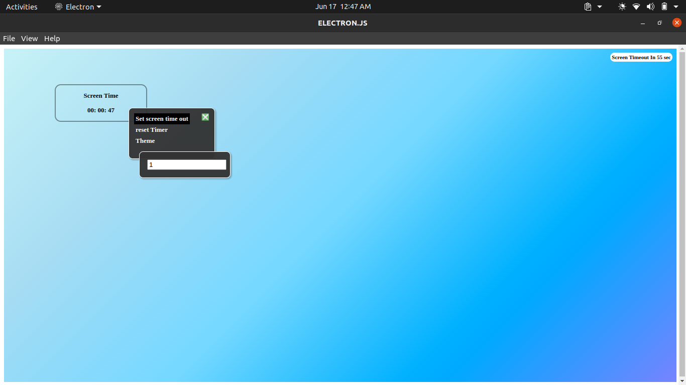
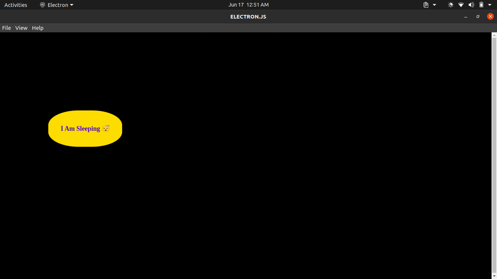

<br>

</div>

## Install

Clone the repo and install dependencies:

```bash
git clone https://github.com/sampete1997/Electron-Screen-TimeOut.git

npm install
```


## Starting Development

Start the app in the `dev` environment:

```bash
npm start
```

## Packaging for Production

To package apps for the local platform:

```bash
npm run package
```

## Docs


```
1. On home page, you can drag screen time widget.
Right corner you can see screen about time out in seconds, it keep update until  there is any activity of mouse or keyboard.

```


<br>
<br>

```
2. Right click on screen timer widget to set new screen timeout duration and other options.

```
<ul>
<li>You can add new time duration to set screen timeout in minute </li>
<li>Reset will set time out to default 1 minute </li>
</ul>


<br>
<br>

```
3. After time out timer will stop and screen fall sleep. if any activity occure on app home page will visible again and time will start from where it was stopped.

```

